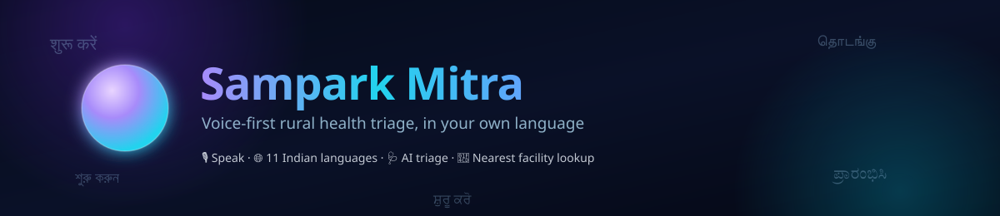
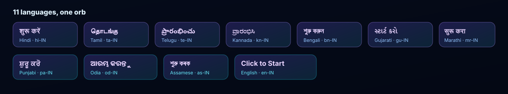
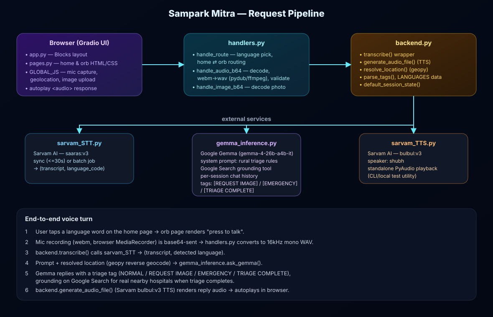

<div align="center">



# Sampark Mitra
### Rural Emergency Triage Hub

**Speak your symptoms in your own language. Get triaged. Get pointed to real, nearby help.**

[](https://www.python.org/)
[](https://www.gradio.app/)
[-4285F4?style=flat-square&logo=google&logoColor=white)](https://ai.google.dev/)
[](https://www.sarvam.ai/)
[](#license)

</div>

---

## What is this?

**Sampark Mitra** ("connection friend") is a voice-first, no-typing-required health triage assistant built for rural and low-literacy users. Someone taps a word in their own language, presses one glowing orb to talk, and an AI triage nurse — powered by Gemma with live Google Search grounding — asks follow-up questions, requests a photo if a symptom is visible, and either escalates to **[EMERGENCY]** or wraps up with **[TRIAGE COMPLETE]** and the names of real, currently-operating hospitals or clinics near the caller's location.

No app to install. No keyboard. It runs entirely in the browser as a [Gradio](https://www.gradio.app/) Blocks app, with a custom JS layer for mic capture, geolocation, and a sound-reactive orb.

<div align="center">

</div>

---

## Features

- **Press-to-talk, not type-to-chat** — designed for users who may not read/write comfortably; everything is driven by tapping a word and speaking.
- **11 Indian languages** — Hindi, Tamil, Telugu, Kannada, Bengali, Gujarati, Marathi, Punjabi, Odia, Assamese, English — auto-detected from speech and used for both the UI copy and the spoken reply.
- **Guided AI triage, not diagnosis** — a strict system prompt keeps Gemma asking one question at a time, capped at 10 questions, and forbids disease diagnosis.
- **Escalates to a photo when needed** — visible symptoms (rash, wound, swelling, eye/mouth/skin issues) trigger a `[REQUEST IMAGE]` step, and the photo is sent straight to Gemma's vision input.
- **Emergency-aware** — the model can end a conversation early with `[EMERGENCY]` the moment triage indicates urgency.
- **Real nearby facilities, not hallucinated ones** — on triage completion, Gemma uses live Google Search grounding to name actual hospitals/clinics near the caller's reverse-geocoded location, and only surfaces names the search tool actually returned.
- **Spoken responses** — every reply is synthesized back to natural speech (Sarvam `bulbul:v3`) and autoplayed, so the whole interaction can happen without reading a single word.
- **Sound-reactive orb UI** — a Web Audio API analyser drives a breathing, glowing orb while the assistant's response plays.
- **Per-session isolation** — each browser session gets its own Gemma conversation history and UI state, so concurrent users never bleed into each other's triage.

---

## How it works

<div align="center">

</div>

### The conversation flow

```
Home page               Orb page                  AI turn
┌───────────────┐       ┌─────────────────┐        ┌───────────────────────────┐
│ Tap a language │──────>│ "Press to talk"  │──────>│ Speech -> text (Sarvam STT) │
│     word       │       │  or upload photo │        │ -> Gemma triage turn        │
└───────────────┘       └─────────────────┘        │ -> text -> speech (Sarvam TTS)│
                                                     └──────────────┬─────────────┘
                                                                    │
                                       ┌────────────────────────────┼────────────────────────────┐
                                       v                            v                             v
                              [REQUEST IMAGE]                 [EMERGENCY]                 [TRIAGE COMPLETE]
                            ask user to upload a           urgent guidance +          summary + real nearby
                              clear photo, then                nearest help              hospitals (via
                              resume triage                                            Google Search grounding)
```

---

## Project structure

| File | Responsibility |
|---|---|
| **`app.py`** | Entry point. Wires up the Gradio `Blocks` layout (hidden router/audio/image inputs, the display page, autoplay audio output) and launches the app. |
| **`pages.py`** | Pure HTML/CSS rendering — the animated home page (scattered language words) and the orb/conversation page — plus the global `CSS`. No backend logic. |
| **`handlers.py`** | The event-handling glue: routes between home and orb pages, runs the audio pipeline (decode -> convert webm to WAV via `pydub`/`ffmpeg` -> validate) and image pipeline, and holds the `GLOBAL_JS` blob for mic capture, geolocation, image upload, and the sound-reactive orb animation. |
| **`backend.py`** | Service wrappers and shared data: STT/TTS clients, `resolve_location()` (reverse geocoding via `geopy`), the `LANGUAGES` table (11 locales' UI strings), `parse_tags()`, and `default_session_state()`. |
| **`gemma_inference.py`** | The triage brain. Talks to Google's Gemma model with a strict system prompt, per-session chat history, image input support, and a live Google Search grounding tool for nearby-facility lookup. |
| **`sarvam_STT.py`** | Speech-to-text via Sarvam AI (`saaras:v3`) — synchronous for clips ≤30s, batch job API for longer recordings. |
| **`sarvam_TTS.py`** | Text-to-speech via Sarvam AI (`bulbul:v3`) with a standalone local playback path (PyAudio) — handy for CLI testing outside the Gradio app. |

---

## Getting started

### Prerequisites

- Python 3.10+
- [`ffmpeg`](https://ffmpeg.org/) on your `PATH` (used by `pydub` to convert browser audio to WAV)
- API keys for:
  - **Sarvam AI** (speech-to-text & text-to-speech)
  - **Google AI (Gemma / Gemini API)** (triage LLM + Search grounding)

### Installation

```bash
git clone https://github.com/<your-org>/sampark-mitra.git
cd sampark-mitra

python -m venv .venv
source .venv/bin/activate   # Windows: .venv\Scripts\activate

pip install gradio pydub geopy sarvamai google-genai pyaudio
```

> `pyaudio` is only required for the standalone `sarvam_TTS.py` CLI playback path — the Gradio app itself streams audio to the browser and doesn't need local audio output.

### Configure environment variables

```bash
export SARVAM_API_KEY="your-sarvam-key"
export GOOGLE_API_KEY="your-google-genai-key"
```

### Run it

```bash
python scripts/app.py
```

Open the local URL Gradio prints (default `http://127.0.0.1:7860`), allow microphone (and optionally location) access, tap a language, and press the orb to talk.

> **No API keys yet?** Every backend call has a graceful mock/fallback (`ask_gemma`, `transcribe`) so the app still boots and is click-through-able without live credentials — you'll just get placeholder responses instead of real triage.

---

## Triage protocol

Gemma's behavior is governed entirely by the system prompt in `gemma_inference.py`:

- Asks **one follow-up question at a time**, and must wrap up triage within **10 questions**.
- Never diagnoses a disease — it triages, it doesn't practice medicine.
- Replies in the **same language** the user spoke, in **under 80 words**.
- If a *visible* symptom comes up (rash, swelling, burn, wound, eye/mouth/skin issue), it immediately replies with `[REQUEST IMAGE]` and asks for a clear photo.
- Every reply ends the triage loop with exactly one of two tags: `[TRIAGE COMPLETE]` or `[EMERGENCY]`.
- On completion, if a location was captured, it uses **Google Search grounding** to name 2–3 real, currently operating nearby hospitals/clinics — never an invented name. If no location was shared, it asks the user for their village/town/city/district instead.

---

## Why "rural"?

The UI is deliberately built around **speaking and tapping, not typing**:

- The home screen is a scatter of tappable words in native scripts — no forms, no menus to read.
- Mic capture, image upload, and geolocation are all one-tap actions with large, clear affordances (`mic-toggle-btn`, upload button, orb).
- Responses are **spoken back**, so literacy is never a blocker to using the tool.
- Location is used only to find nearby real care — it's reverse-geocoded server-side and never displayed as raw coordinates to the model beyond a human-readable place name.

---

## Tech stack

| Layer | Technology |
|---|---|
| UI / app shell | [Gradio](https://www.gradio.app/) Blocks, custom CSS + vanilla JS |
| Speech-to-text | [Sarvam AI](https://www.sarvam.ai/) `saaras:v3` |
| Text-to-speech | [Sarvam AI](https://www.sarvam.ai/) `bulbul:v3` |
| Triage LLM | Google **Gemma** (`gemma-4-26b-a4b-it`) via `google-genai`, with Google Search grounding |
| Geocoding | [geopy](https://geopy.readthedocs.io/) (Nominatim) |
| Audio conversion | [pydub](https://github.com/jiaaro/pydub) + `ffmpeg` |

---

## Disclaimer

Sampark Mitra performs **triage guidance only** — it is not a diagnostic tool and does not replace professional medical care. In a life-threatening emergency, contact local emergency services immediately.

---

## License

Apache License 2.0 — see `LICENSE` for details.
